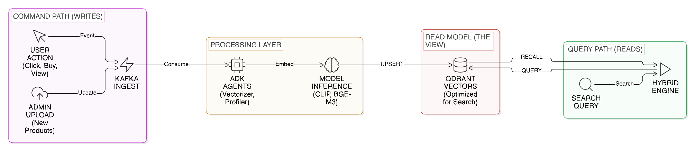
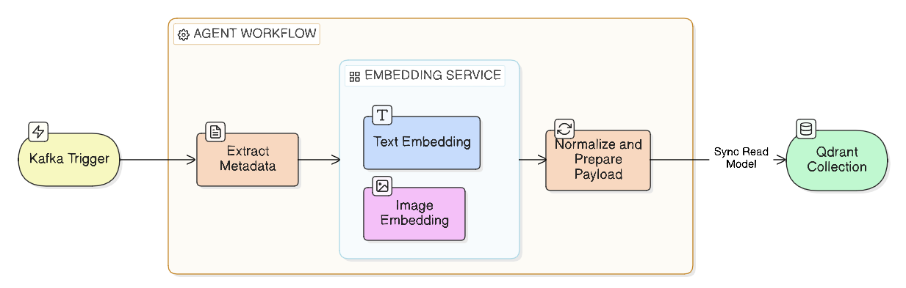
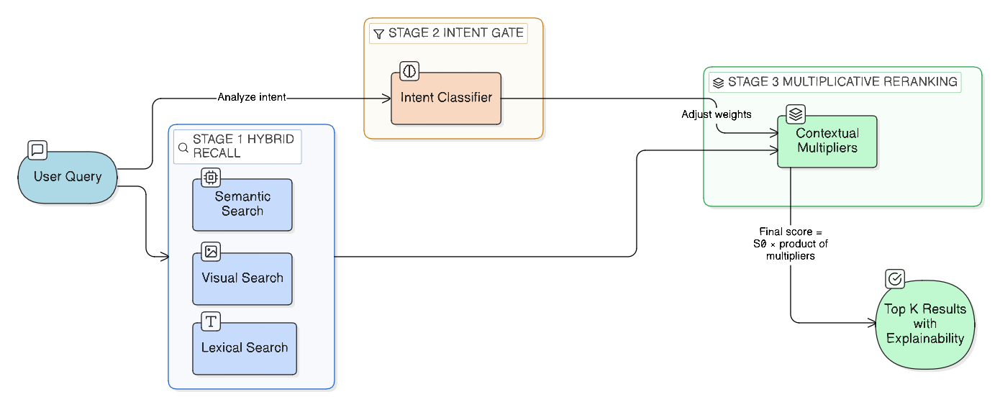

# Nexus AI Store – Hybrid Search & Recommendation Engine

## Project Overview
Nexus AI Store is an end-to-end, production-oriented **hybrid search and recommendation platform** designed for modern e-commerce. It combines **semantic vector search, visual similarity, lexical retrieval (BM25), intent classification, and deep context-aware reranking** to deliver results that are not only relevant, but situationally intelligent.

The core objective of the project is to demonstrate how **event-driven architectures and CQRS**, combined with **vector databases (Qdrant)** and **multi-signal reranking**, can dramatically improve:
- Search relevance
- Latency under load
- Personalization depth
- System scalability and evolvability

This project was built and deployed for a hackathon, with an emphasis on **engineering rigor**, **reproducibility**, and **real-world constraints**.

Live platform: http://nexusblockbyblock.francecentral.cloudapp.azure.com/

users for testing : 

email : user_sarah@gmail.com
password : 123456

email : user_meriem_mom@gmail.com
password : 123456

---

## Core Objectives

1. Build a hybrid search engine that goes beyond keyword matching
2. Separate ingestion, profiling, and querying concerns using CQRS
3. Use event-driven pipelines to eliminate synchronous bottlenecks
4. Implement a transparent, explainable reranking system
5. Achieve low-latency search while maintaining rich personalization

---

## High-Level Architecture

The platform follows a **distributed, event-driven microservice architecture**.


Key principles:
- **CQRS**: Write paths (data ingestion, profiling) are fully decoupled from read paths (search & recommendation)
- **Event-driven**: Kafka is used as the backbone for asynchronous communication
- **Stateless query services**: Search latency is not impacted by writes

### Main Components

- API Gateway
- Search Engine (Hybrid Retrieval + Reranking)
- Embedding Service (centralized model inference)
- Product Vectorizer (write side)
- User Profiler (write side)
- Qdrant (vector read model)
- MongoDB (transactional + analytical store)

---

## Why Event-Driven + CQRS

### The Problem with Synchronous Architectures

In traditional systems:
- Product updates block search availability
- User profiling increases query latency
- Model inference happens inline

This leads to:
- High p95 latency
- Cascading failures
- Poor scalability

### Our Solution

We **separate responsibilities**:



**Command Side (Writes)**
- Product ingestion
- User behavior processing
- Profile updates
- Vector computation

**Query Side (Reads)**
- Hybrid retrieval
- Reranking
- Explanation generation

All writes emit **Kafka events**. Query services never wait on writes.

### Effects

- Search latency becomes stable and predictable
- Write throughput scales independently
- Models can evolve without query downtime

---

## Qdrant Integration (Deep Dive)

Qdrant is the **read model** of the system.

Each product is stored as a single point with:

- `text_vector`: semantic embedding (BGE-M3)
- `visual_vector`: CLIP image embedding
- `payload`: rich metadata (price, brand, category, stats)

### Why Qdrant

- Native support for multiple vectors per point
- Fast ANN search with filtering
- Payload-aware filtering
- Production-ready performance

### Collections

- `products`: hybrid searchable catalog
- `users`: user preference vectors
- `user_intents`: wishlist and soft intent vectors

Qdrant is **never written to synchronously by the search engine**. All updates happen via background agents consuming events.

---

## Background Agents (ADK Agents)

The system relies on **autonomous background agents** that operate continuously and independently from user queries. Each agent has a single responsibility, clear inputs (events), and explicit side effects (state updates).

These agents are critical to achieving low latency and deep personalization.

---

### Product Vectorizer Agent

**Role**: Build and maintain the product read model.



**Triggers**:
- Product created
- Product updated
- Price change
- Image change

**Inputs**:
- Kafka product events
- Product metadata
- Product images

**Tools & Models**:
- Embedding Service (BGE-M3 for text)
- CLIP ViT-B/32 for images
- Qdrant SDK

**Processing Steps**:

1. Consume product event from Kafka
2. Generate text embedding from name + description
3. Generate visual embedding from product image
4. Normalize vectors
5. Upsert into Qdrant `products` collection with payload

**Why This Matters**:

- Vector computation never blocks search
- Products are always query-ready
- Model upgrades do not require downtime

---

### User Profiler Agent

**Role**: Build long-term and short-term user representations.

**Triggers**:
- View events
- Click events
- Add-to-cart
- Purchase
- Wishlist actions

**Inputs**:
- Kafka user interaction events

**Tools & Models**:
- Embedding Service (BGE-M3)
- Qdrant SDK
- MongoDB for historical aggregation

**Processing Steps**:

1. Aggregate recent interactions
2. Compute short-term taste vectors
3. Update long-term preference vectors
4. Track negative taste and dislikes
5. Store vectors in Qdrant `users` collection

**Stored Signals**:

- Long-term taste vector
- Negative preference vector
- Brand affinity scores
- Category spending statistics

**Why This Matters**:

- Personalization is precomputed
- Search-time logic stays lightweight
- Cold-start and warm users handled uniformly

---

### Intent & Wishlist Agent

**Role**: Capture soft, future-oriented intent.

**Triggers**:
- Wishlist add
- Repeated product views
- Budget input

**Tools**:
- BERT intent classifier
- Embedding Service
- Qdrant

**Processing Steps**:

1. Classify intent type
2. Generate intent vector
3. Attach budget and urgency metadata
4. Store in `user_intents` collection

These intent vectors are later matched during reranking.

---

## Hybrid Retrieval Strategy

Retrieval is intentionally **recall-oriented**.



### 1. Semantic Retrieval (Vector Search)

We embed the query using **BGE-M3** and search `text_vector`.

Strengths:
- Handles paraphrases
- Handles vague queries
- Language-agnostic

### 2. Visual Retrieval (Cross-Modal CLIP)

The same query is embedded using CLIP text encoder and matched against `visual_vector`.

Strengths:
- Captures aesthetic intent
- Works for fashion and design-heavy categories

### 3. Lexical Retrieval (BM25)

BM25 is used as a **lexical baseline and safety net**.

BM25 answers questions semantic models are bad at:
- Exact model names ("Galaxy A56")
- SKUs and codes
- Very short queries

BM25 score is later normalized and injected into reranking.

### Why Hybrid Matters

- Vector search alone may miss exact matches
- BM25 alone fails on exploratory queries

Hybrid retrieval guarantees **high recall**, which is critical because **precision is handled later by reranking**.

---

## Intent Classification

Before reranking, queries are classified using a fine-tuned **BERT intent classifier**.

### Intent Classes

- `broad_explore`: "summer dress", "gaming laptop"
- `use_case`: "laptop for work", "dress for party"
- `specific_product`: "Samsung Galaxy A56 5G"

### Why Intent Matters

Intent directly changes scoring behavior:

- Budget constraints are relaxed for `specific_product`
- Diversity penalties are disabled
- Brand affinity is amplified
- Exact matches are boosted

This prevents classic failures such as:
- Hiding expensive items when the user clearly wants a specific product
- Over-diversifying when precision is expected

---

## Context-Aware Reranking (Core Innovation)

Reranking is **multiplicative, not additive**.

### Why Multiplicative Scoring

Additive scoring allows strong signals to cancel each other out. For example, a strong brand affinity could mask a severe dislike or an obvious budget mismatch.

Multiplicative scoring enforces **hard consistency**:
- A strong negative signal always penalizes the final score
- A strong contextual signal (life event, wishlist) always dominates
- No single heuristic can overpower the system arbitrarily

### Base Formula

Let:
- s0 be the base relevance score from hybrid retrieval
- mi be independent contextual multipliers

FinalScore = s0 × Π(mi)

This means relevance is **gated by context**, not adjusted cosmetically.

---

## Pseudo-Mathematical Scoring Breakdown

Below is a simplified but faithful representation of the reranking logic.

### Step 1: Base Retrieval Score

Each product p receives a base score:

s0(p) = max(semantic_score, visual_score, bm25_score)

This guarantees high recall and protects exact matches.

---

### Step 2: Contextual Multipliers

For each candidate product p, we compute:

- m_life(p): life event relevance
- m_wish(p): wishlist and soft intent similarity
- m_brand(p): brand loyalty
- m_trait(p): trait–category alignment
- m_season(p): seasonal relevance
- m_budget(p): budget compatibility
- m_market(p): market quality feedback
- m_neg(p): negative taste / dislike penalty

Each multiplier is bounded:

mi(p) ∈ [0.1, 3.5]

This prevents score explosions while preserving dominance when justified.

---

### Step 3: Intent-Aware Adjustments

Let I be the classified intent:

- I = specific_product
- I = use_case
- I = broad_explore

Intent directly alters the multiplier set:

- If I = specific_product:
  - m_budget(p) = 1.0
  - diversity penalties disabled

- If I = broad_explore:
  - diversity and seasonal multipliers amplified

This avoids penalizing precision queries with exploratory heuristics.

---

### Step 4: Final Score

FinalScore(p) = s0(p) × m_life × m_wish × m_brand × m_trait × m_season × m_budget × m_market × m_neg

Candidates are ranked by decreasing FinalScore.

---

### Step 5: Explanation Selection

The dominant multiplier determines the explanation shown to the user:

- High m_life → "Perfect for your upcoming plans"
- High m_wish → "Matches your wishlist preferences"
- High m_brand → "Because you love this brand"

This guarantees **alignment between ranking and explanation**.

---

## Reranking Signals (Detailed)


Each candidate is evaluated against the following signals:

### Life Events
- Time-bounded boosts
- Urgency-aware
- Category constrained

### Wishlist & Soft Intents
- Vector similarity to intent vectors
- Budget-aware
- Image-aware when applicable

### Brand Affinity
- Log-scaled loyalty boost
- Prevents monopolization

### Seasonal Awareness
- Query season detection
- Tag-based seasonal alignment
- User active months

### Budget & Purchasing Power
- Category-specific anchors
- Trait-aware elasticity
- Intent-aware bypass

### Negative Taste & Dislikes
- Vector-level repulsion
- Explicit dislike rules

### Market Feedback
- Return rate penalties
- Hesitation-aware discount boosts

### Cold Start Logic
- Demographic inference
- Popularity-weighted desirability

---

## Explainability

Each result includes a **human-readable explanation** derived from the dominant multiplier:

- "Perfect for your work-from-cafe routine"
- "Because you love Samsung"
- "Matches your wishlist preferences"

This improves trust and user experience.

---
---

## Reinforcement Learning for Ranking Optimization

Beyond static reranking heuristics, the platform includes a **Reinforcement Learning (RL) pipeline** that learns optimal ranking weights from real user interactions.

### The Problem

While the multiplicative reranking system is powerful, the weight values (W_COLLAB_POS, W_TRAIT, W_BRAND, etc.) are manually tuned. Different user contexts may benefit from different weight distributions.

### The Solution

We built an **offline RL training pipeline** using **Conservative Q-Learning (CQL)** that:
- Learns personalized ranking weights from logged search sessions
- Optimizes for conversion rate and revenue
- Remains conservative to avoid unsafe exploration

---

### Workflow 1: Search Logs Generation


**Process**:

1. **User Simulation**: LLM-based simulator generates realistic search queries from real user profiles
2. **Search Execution**: Query runs through V2 Search API with current ranking weights
3. **Product Selection**: LLM selects which product to engage with (purchase/cart/wishlist)
4. **Action Logging**: User action sent to Events API and tracked
5. **Log Creation**: Complete episode captured (state → action → outcome)
6. **Outcome Tracking**: Search logs updated with user action and engagement metrics

**Output**: Structured JSONL logs containing:
- User context (traits, preferences, purchase history)
- Ranking weights used
- Products shown and their ranks
- User action and reward signal

This creates a **rich offline dataset** without requiring live A/B tests.

---

### Workflow 2: RL Training Pipeline


**Process**:

1. **Load Logs**: Read collected search sessions (216+ samples)
2. **Reward Engineering**: Compute position-weighted rewards based on user actions
   - Purchase at rank 1 = high reward
   - No engagement = negative reward
3. **Feature Extraction**: Normalize state (23 dims) and action (7 dims) vectors
4. **Train CQL Model**: Conservative Q-Learning on GPU (30 epochs)
5. **Counterfactual Evaluation**: Estimate policy performance using Inverse Propensity Scoring
6. **Model Export**: Save trained policy for deployment

**Output**:
- Trained RL policy: `π(user_context) → optimal_weights`
- Performance metrics: +0.95% conversion improvement
- Training visualizations: loss curves and policy comparisons

---

### Key Innovations

**Conservative Q-Learning**: Unlike online RL, CQL learns from logged data without requiring live experiments. The conservative penalty ensures the learned policy stays close to proven behavior.

**Counterfactual Evaluation**: We use Inverse Propensity Scoring (IPS) to estimate policy performance on unseen data, providing confidence intervals without A/B tests.

**Personalized Weights**: Instead of fixed ranking weights, the RL policy predicts optimal weights for each user context in real-time.

---

### Integration Path

The RL system is designed for **gradual deployment**:

1. Train offline on collected logs
2. Validate with counterfactual evaluation
3. Deploy to 10% traffic (shadow mode)
4. Monitor metrics (conversion, MRR, revenue)
5. Scale to 100% if improvements hold

This allows us to **optimize search relevance continuously** as user behavior evolves.

---

## Hosting & Deployment (Azure)

The system is deployed on **Azure VM (France Central)** using Docker Compose.

Benefits:
- Simple reproducibility
- Clear service boundaries
- Hackathon-friendly deployment

---

## Installation & Run Guide

Prerequisites:
- Docker
- Docker Compose

Steps:

```bash
git clone <repository-url>
cd nexus-ai-store
docker compose build
docker compose up -d
```

Access:
- Frontend: http://localhost
- API Gateway: http://localhost:8008
- Search Engine: http://localhost:8002

---

## Technologies Used

- Python 3.11
- Qdrant (latest)
- Kafka 7.6.1
- MongoDB (latest)
- Sentence-Transformers (BGE-M3)
- CLIP ViT-B/32
- PyTorch
- Docker & Docker Compose
- Azure VM

---

## Conclusion

This project demonstrates that **search quality is not a single model problem**, but a systems problem.

By combining:
- Event-driven architecture
- CQRS
- Hybrid retrieval
- Intent-aware reranking

We achieved a system that is:
- Fast
- Explainable
- Deeply personalized
- Production-aligned

This is not a prototype search engine. It is a scalable foundation.

